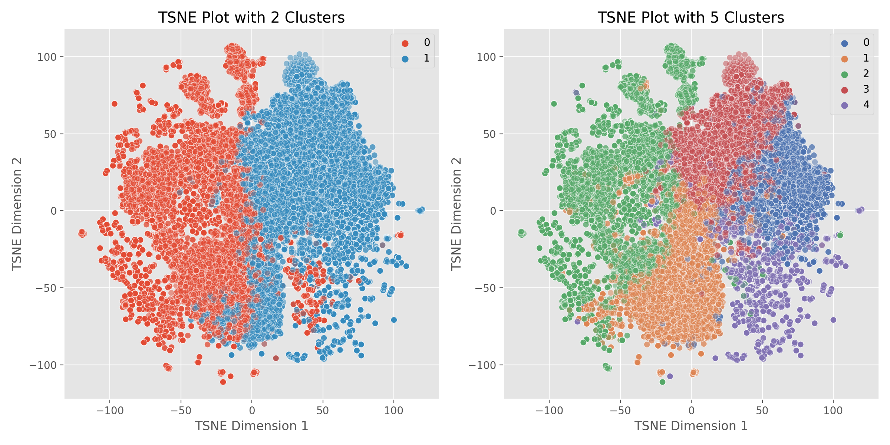

# emoji_polysemy

This is the repo for my Emoji Polysemy project.

In this project I use a version of BERT trained on tweets to extract contextual embeddings for a selection of emojis. Then for each emoji, I cluster their collection of embeddings. The clusters produced by this process represent the various semantic meanings of an emoji. The goal of this project is to quantify an emoji's polysemy and determine if there are any temporal patterns in the usage rate of those clusters over the span of 2014 to 2022.

### Notebooks

- [Emoji Cleaning and Analysis](Emoji%20Cleaning%20and%20Analysis.ipynb) 
Where I clean, munge, and transform the raw twitter data. Here I extract the embeddings and save them.
- [Topics, Emoition, and Sentiment Extraction](Topics%2C%20Emotion%20and%20Sentiment%20Extraction.ipynb)
Where I grab additional data used to analyze the emoji clusters. I use models hosted on huggingface to extract topics, emotions, and sentiment from the tweets.
- [Clustering Prayer Hands Emoji](Clustering%20Prayer%20Hands%20Emoji.ipynb)
I pick one emoji (prayer hands) to demonstrate a thorough execution of my methodology 
- [Cluster Other Emojis](Clustering%20Other%20Emojis.ipynb)
I create a clustering hub class (a single object that can reproduce my methodologyn from the prayer hands emoji) for the purpose analyzing other emojis.

